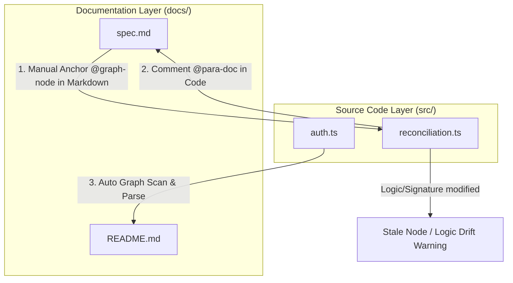

# Double-Binding Traceability between Docs and Code

In large software projects, technical documentation easily drifts away from the actual source code (Documentation Drift). To solve this issue permanently, the PARA Workspace enforces a **Double-Binding Traceability** mechanism between documentation (`docs/`) and source code (`src/`) utilizing the Code-Graph tool (`para-graph`).

Below are the details of how this two-way coupling works and how to leverage it.

---

## 1. 📂 Flow 1: Docs ➔ Code (Documenting Source Code)

**Meaning:** Identifying which part of the Markdown documentation explains which codebase entity or file.

### 🔗 Execution Mechanism (docAnchors)
This link is established manually by inserting a special HTML comment anchor immediately underneath the header in your Markdown file:

```markdown
### [Heading explaining code functionality]
<!-- @graph-node: [code_file_path_or_identifier] -->
```

*   **File level**: `src/lib/auth.ts`
*   **Function level**: `src/lib/auth.ts:verifySessionCookie`
*   **Concrete Example**:
    ```markdown
    ### Session Cookie Verification
    <!-- @graph-node: src/lib/auth.ts:verifySessionCookie -->
    This function decrypts and verifies the validity of the Signed Session Cookie sent by the client...
    ```

### 📊 Key Benefits
*   **Documentation Coverage Metrics**: The Code-Graph engine knows exactly what percentage of critical source files have been documented.
*   **Weighted Health Score**: The Docs Health Score on the Quality Dashboard is calculated using the relative importance (weights) of successfully anchored God Nodes.

---

## 2. 💻 Flow 2: Code ➔ Docs (Mapping Back from Source Code)

**Meaning:** From a specific source code file, identifying which technical documents explain it, or whether it has been completely missed.

### 🔗 Code-to-Docs Back-Anchoring (para-doc)
In addition to anchoring from the document side, Double-Binding requires establishing backward links from the source code side using a special comment syntax `@para-doc`. Developers place this comment immediately before the declaration of a function, class, or at the top of a file:

```typescript
// @para-doc [document_filename.md#neo_anchor]
```

*   **Concrete Example**:
    ```typescript
    // @para-doc [auth-spec.md#verify-session]
    export function verifySessionCookie(cookie: string) {
        // cookie verification logic...
    }
    ```

When parsing the graph, the system audits both directions in parallel:
1. Markdown `<!-- @graph-node -->` tags pointing to code.
2. Code `// @para-doc` comments pointing back to Markdown documents.
The **Completed** state (100% health status) on the Quality Dashboard is only awarded when both directions are validated and matched.

### 🔍 Automated Graph Enrichment
When you build the project graph database (`para-graph build`), the static analyzer parses the entire codebase to build a call graph. It then maps it back against the anchors located inside the `docs/` folder:

*   **Detecting Unlinked Code**: The system automatically lists important files or God Nodes that are not yet referenced by any Markdown file.
*   **Detecting Stale Nodes**: If a function is renamed, parameters change, or a source file is deleted while the documentation anchor still points to the old signature, the system marks the node as **Stale** and displays warnings on the Quality Dashboard.
*   **AI Context Bundling**: AI Agents can fetch all source declarations matching a specific document header to automatically write updates without hallucinating (Anti-Hallucination).

---

## 🔁 Two-Way Integration Flow




---

## 💡 Suggested Prompts & Commands

Here are some useful prompts and commands structured by mapping directions to help you sync your documentation and codebase:

### 📂 Direction 1: Docs ➔ Code (Markdown pointing to Code)
*   **Review current document mapping coverage and quality**:
    ```text
    /docs [project-name] review --graph
    ```
*   **Scaffold new document templates with appropriate graph-node anchors**:
    ```text
    /docs [project-name] new --graph
    ```

### 💻 Direction 2: Code ➔ Docs (Source code pointing back to Docs)
*   **Sync and update documentation automatically after codebase changes (clear stale nodes)**:
    ```text
    /docs [project-name] update --graph
    ```
*   **Identify critical source files (God Nodes) lacking backward links (Unlinked Code)**:
    ```text
    List God Nodes or critical source files in [project-name] that do not have @para-doc comment anchors pointing to documentation
    ```
*   **Audit code comments to find mismatched `@para-doc` references**:
    ```text
    Audit @para-doc comment anchors inside the source code of [project-name]
    ```

