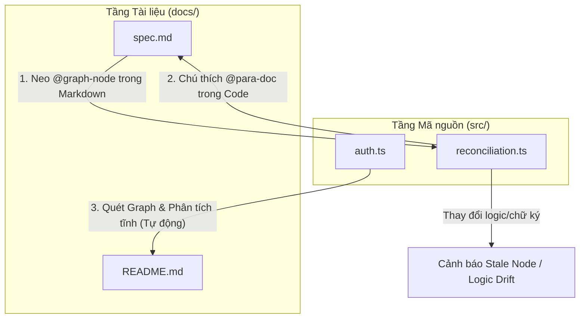

# Liên kết hai chiều giữa Tài liệu và Mã nguồn (Double-Binding Traceability)

Trong một dự án lớn, tài liệu kỹ thuật rất dễ bị lệch pha với mã nguồn thực tế (Documentation Drift). Để giải quyết triệt để vấn đề này, PARA Workspace áp dụng cơ chế **Double-Binding Traceability** (Liên kết hai chiều) giữa tài liệu (`docs/`) và mã nguồn (`src/`) thông qua công cụ Đồ thị mã nguồn Code-Graph (`para-graph`).

Dưới đây là chi tiết hoạt động của hai chiều liên kết này và cách khai thác chúng.

---

## 1. 📂 Chiều 1: Docs ➔ Code (Tài liệu hóa mã nguồn)

**Ý nghĩa:** Xác định một phần tài liệu Markdown đang thuyết minh cho đoạn code hoặc cấu phần nào trong mã nguồn.

### 🔗 Cơ chế thực thi (docAnchors)
Chiều liên kết này được thiết lập thủ công bằng cách chèn một chú thích neo đặc biệt (HTML comment anchor) ngay dưới tiêu đề của phần mô tả trong file Markdown:

```markdown
### [Tiêu đề mô tả tính năng]
<!-- @graph-node: [đường_dẫn_code_hoặc_định_danh] -->
```

*   **Đường dẫn file**: `src/lib/auth.ts`
*   **Chi tiết đến hàm**: `src/lib/auth.ts:verifySessionCookie`
*   **Ví dụ thực tế**:
    ```markdown
    ### Xác thực Session Cookie
    <!-- @graph-node: src/lib/auth.ts:verifySessionCookie -->
    Hàm này thực hiện giải mã và xác minh tính hợp lệ của Signed Cookie được gửi từ client...
    ```

### 📊 Lợi ích
*   **Xác định độ phủ tài liệu (Documentation Coverage)**: Đồ thị biết chính xác bao nhiêu phần trăm mã nguồn quan trọng đã được viết tài liệu.
*   **Tính điểm sức khỏe (Docs Health Score)**: Điểm số sức khỏe tài liệu trên Dashboard được tính dựa trên số lượng nút cốt lõi (God Nodes) đã được gán neo thành công.

---

## 2. 💻 Chiều 2: Code ➔ Docs (Ánh xạ ngược từ Mã nguồn)

**Ý nghĩa:** Từ một file code cụ thể, xác định xem nó đang được giải nghĩa bởi những tài liệu nào, hoặc liệu nó có đang bị bỏ quên hay không.

### 🔗 Cơ chế neo ngược từ Code (para-doc)
Bên cạnh neo từ phía tài liệu, Double-Binding yêu cầu thiết lập neo ngược từ phía mã nguồn thông qua cú pháp chú thích đặc biệt `@para-doc`. Lập trình viên đặt comment này ngay trước dòng khai báo hàm, lớp hoặc ở đầu tệp tin:

```typescript
// @para-doc [ten_file_tai_lieu.md#neo_anchor]
```

*   **Ví dụ thực tế**:
    ```typescript
    // @para-doc [auth-spec.md#verify-session]
    export function verifySessionCookie(cookie: string) {
        // logic xác thực cookie...
    }
    ```

Khi chạy phân tích đồ thị, hệ thống sẽ đối chiếu song song:
1. Neo `<!-- @graph-node -->` trong tài liệu trỏ tới code.
2. Comment `// @para-doc` trong code trỏ ngược lại tài liệu.
Trạng thái **Đạt chuẩn / Đầy đủ (Completed)** 100% trên Dashboard chỉ được ghi nhận khi cả hai chiều liên kết này đều hợp lệ và khớp nhau.

### 🔍 Cơ chế tự động hóa đồ thị (Graph Enrichment)
Khi bạn chạy công cụ đồ thị (`para-graph build`), hệ thống sẽ quét tĩnh toàn bộ codebase để lập bản đồ gọi hàm (Call Graph). Sau đó, nó đối chiếu ngược lại với các neo trong thư mục `docs/`:

*   **Phát hiện Code chưa được tài liệu hóa (Unlinked Code)**: Hệ thống tự động liệt kê các tệp tin hoặc các God Nodes quan trọng chưa hề được liên kết đến bất kỳ tệp Markdown nào.
*   **Phát hiện Tài liệu lỗi thời (Stale Nodes)**: Nếu một hàm bị đổi tên, đổi tham số, hoặc file code bị xóa nhưng neo trong tài liệu vẫn trỏ tới thông tin cũ, hệ thống sẽ đánh dấu nút đó bị **Stale** (lỗi thời) và cảnh báo trên Dashboard.
*   **AI Context Bundling**: AI Agent có thể lấy ra toàn bộ các đoạn code liên quan đến một bài viết tài liệu cụ thể để tự động cập nhật nội dung một cách chính xác mà không bị ảo tưởng (Anti-Hallucination).

---

## 🔁 Tóm tắt luồng tương tác hai chiều




---

## 💡 Đề xuất câu lệnh & Prompt gợi ý

Dưới đây là các câu lệnh hữu ích được phân chia theo hai chiều liên kết giúp bạn dễ dàng đồng bộ tài liệu và mã nguồn:

### 📂 Chiều 1: Docs ➔ Code (Tài liệu trỏ tới Code)
*   **Kiểm tra độ phủ và chất lượng liên kết của tài liệu hiện tại**:
    ```text
    /docs [project-name] review --graph
    ```
*   **Tự động tạo khung tài liệu mới và neo graph-node thích hợp**:
    ```text
    /docs [project-name] new --graph
    ```

### 💻 Chiều 2: Code ➔ Docs (Mã nguồn trỏ ngược tới Tài liệu)
*   **Đồng bộ và cập nhật ngược tài liệu khi mã nguồn thay đổi (giải phóng stale nodes)**:
    ```text
    /docs [project-name] update --graph
    ```
*   **Tìm các file code quan trọng (God Nodes) chưa được liên kết ngược (Unlinked Code)**:
    ```text
    Liệt kê các God Nodes hoặc tệp mã nguồn chưa có comment neo @para-doc trỏ tới tài liệu của [project-name]
    ```
*   **Đối soát các chú thích neo `@para-doc` bị lệch vị trí trong code**:
    ```text
    Chạy lệnh đối soát comment neo @para-doc trong mã nguồn của dự án [project-name]
    ```

